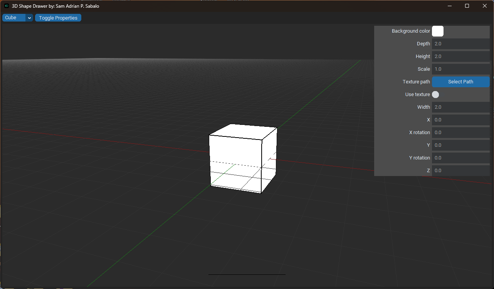
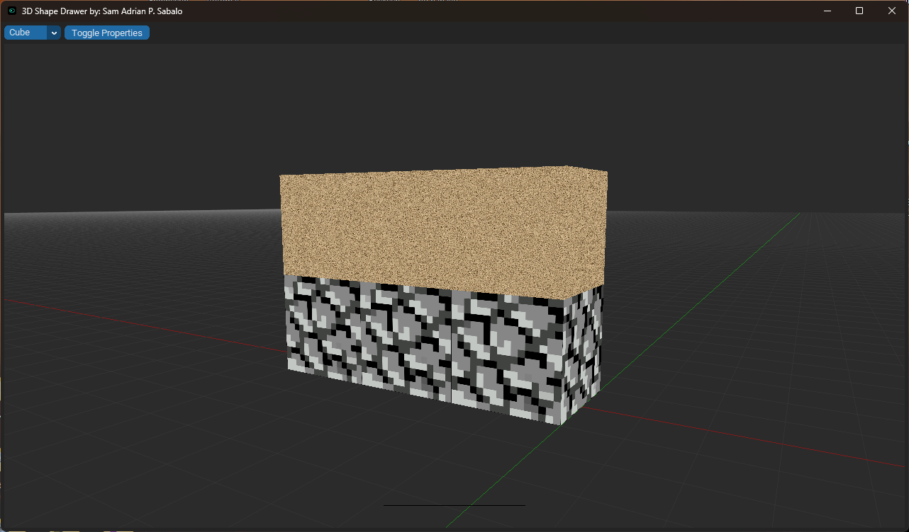

# 3D Shape Drawer App (Immediate Mode Rendering)

Welcome to the 3D Shape Drawer App! Before you can start using the app, please follow these instructions carefully.

## Prerequisites
- Make sure you have the latest version of Python installed on your system.
- (Optional) Create a virtual environment.

## Installation
1. Clone or download this repository to your local machine.
2. Open a terminal or command prompt and navigate to the project's root directory.

   ```shell
   cd path/to/3D-Shape-Drawer

3. Install the required libraries from the requirements.txt file using pip:

   ```shell
   pip install -r requirements.txt

## Running the App

    python app.py

The App should now load and you should now be able to use the app

## Features

- Add shapes
- Resize shapes
- Rotate shapes
- Move shapes
- Change color
- Add texture
- Delete shapes
- Duplicate shapes
- Key shortcuts
  
## Future Improvements

- Individual vertices translation
- Resize width and height separately
- Implement undo/redo functionality
- Implement active usage of mouse for interaction
- Add support for plane
- Import 3D files (obj, stl, ply, etc)
- Import/Export of current work.

## Images




## Acknowledgements

- [CTkColorPicker](https://github.com/Akascape/CTkColorPicker): A much better color picker when it comes to UI than the default Tkinter color picker.
- [pyopengltk](https://github.com/jonwright/pyopengltk): Helped me to actually draw shapes on a tkinter frame using OpenGL. If it wasn't for this I would've moved on to use PyGame for the UI.

## License

This project is licensed under the GNU General Public License v3.0 - see the [LICENSE](LICENSE) file for details.

The GPL-3.0 license grants users the freedom to use, modify, and distribute this software under certain conditions. It also requires that any modifications made to the software are also licensed under the GPL-3.0.

